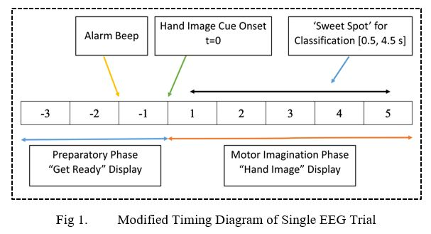
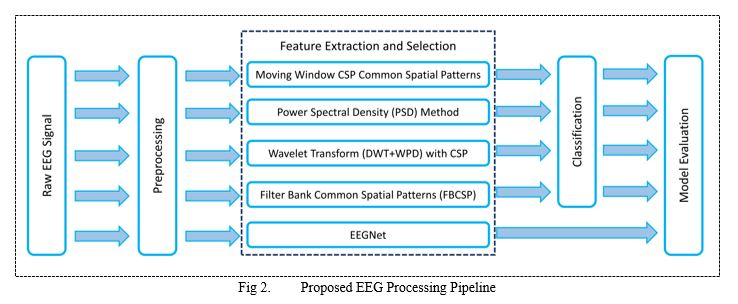
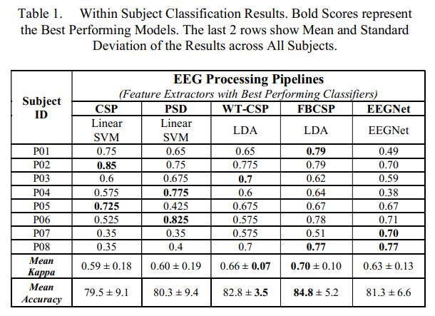
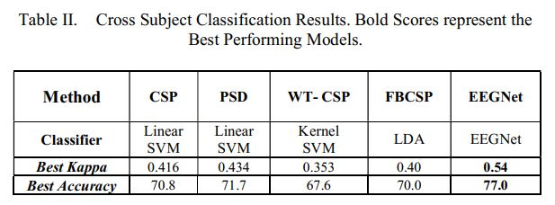

# EEG Hand-Grasp Movement Classification
The repo contains open-source code and dataset related to my publication "Classification of Hand-Grasp Movements of Stroke Patients using EEG Data" 

## Abstract of the Final Report
Electroencephalography (EEG) based Brain Controlled Prosthetics can potentially improve the lives of people with movement disorders, however, the successful classification of the brain thoughts into correct intended movement is still a challenge. In recent years, machine learning based methods, especially deep neural networks, have improved the pattern recognition and classification performance of computer vision systems. However, there is a need to evaluate the classical EEG signal processing algorithms against advanced machine learning based variants, specifically in the domain of Brain Computer Interfaces (BCI). This study aims to be a benchmark where we evaluate the performance of 5 popular motor imagery BCI pipelines and compare classical signal processing techniques (wavelet transform and power spectral density) with motor imagery specific algorithms (Common Spatial Patterns and Filter Bank Common Spatial Patterns (FBCSP)) and a state-of-the-art deep neural network based EEGNet algorithm. The experiments were performed on an open-source EEG dataset of hemiparetic stroke patients and both within subject and cross subject performance of the aforementioned algorithms was evaluated based on kappa scores. We empirically found that, for within subject classification, FBCSP method still is the gold-standard for motor imagery task with a mean kappa score of about 0.70 (84.8% accuracy) while for cross subject classification, due to the availability of a large amount of data, deep learning based EEGNet method outperformed all the other methods with a large margin and gave kappa value of 0.54 (77.0% accuracy). We believe these results would help BCI researchers to select a suitable BCI pipeline for their task that could help in the development of robot assisted therapies or as an interface for assistive devices. 

## Dataset Overview
The open-source dataset was provided by CBCI Challenge-2020 organized by University of Essex. We are provided an EEG Dataset of 10 hemiparetic stroke patients having hand functional disability. The dataset consists of two classes which are left and right-hand grasp attempt movements. The participants in the competition are required to provide accurate and robust decoding of these movements, from the provided brain activity only. The automated decoding of these kinesthetic movements from brain signals is helpful for the development of robot-assisted therapies or interfaces for assistive technologies or rehabilitation. The decoding will be done in two ways: 1) one is within-subject classification where the training data from the same subject will be used to classify that subject’s test data, 2) another challenge will be to perform these decoding across subjects where the training data of some subjects would be used to predict test data of unseen ones.
 - [Dataset Link](https://github.com/5anirban9/Clinical-Brain-Computer-Interfaces-Challenge-WCCI-2020-Glasgow)
 - [Competition Website Link](https://sites.google.com/view/bci-comp-wcci/?fbclid=IwAR37WLQ_xNd5qsZvktZCT8XJerHhmVb_bU5HDu69CnO85DE3iF0fs57vQ6M)

## How to Run it?
The code is primarily written in Python 3  using Jupyter Notebooks. In order to run, it you need to have Python and Jupyter Notebook on your computer. Once you have these on your system, install the required packages, if necessary, and run all code blocks sequentially for top to bottom. The easiest way is to download this whole directory along with data, so you won't have to worry about manually changing the datast paths.

#### Required Packages
- Braindecode == 0.5
- PyWavelets == 1.1.1
- ipython == 7.16.1
- matplotlib == 3.2.2
- mne == 0.21.0
- numpy == 1.18.5
- pandas == 1.0.5
- scikit_learn == 0.23.1
- scipy == 1.5.0
- skorch == 0.9.0
- torch == 1.6.0

The required packages are also listed in requirements.txt file. To install them via pip, simply go to https://pypi.org/ and search by the name of your required package and it would tell you exactly the pip command. All these packages are quite mature in terms of their development, so probably you won't face any issues even if you have other versions of the same packages installed on your system. If you want to be highly defensive then go for virtual environments.

#### For Beginners
If you are new to Python then I would highly suggest you to install [Anaconda](https://www.anaconda.com/) which would automatically manage and update different libraries to avoid conflicts. Moreover, it also comes with Jupyter Notebook pre-installed and a lot of relevant python packages like Numpy, Scipy, Matplotlib etc. [Anaconda Installation Instructions](https://docs.anaconda.com/anaconda/install/)

#### Having Issue with Previewing Files
You can view the code by opening the files at Github. Sometimes, Github have some issues in previewing Jupyter Notebooks so you may try again to 'Reload' or Just copy paste the url of the notebook and paste it in  [nbviewer](https://nbviewer.jupyter.org/)

## Single Trial Timing Details

## Block Diagram

## Results

#### Within Subject Classification Results

#### Cross Subject Classification Results

## Contacting the Author
If you are facing some issues in running the code then open a [Github Issue](https://github.com/SulemanRasheed/CBCI-Competition-2020/issues). Otherwise, if you need more info about the project or just want to discuss some ideas related to this project then feel free to contact me at: 
Email: SulemanRasheedEngr@gmail.com
